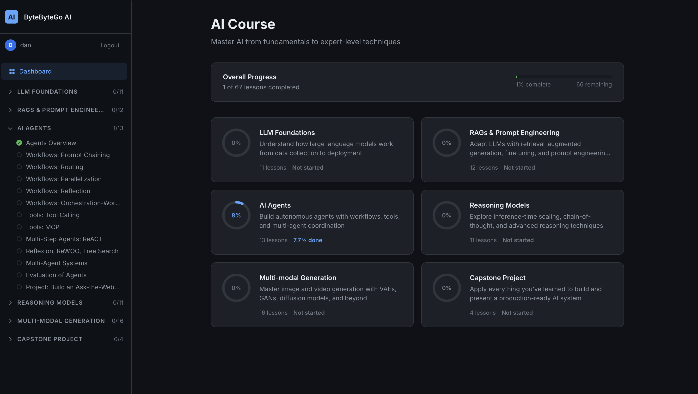
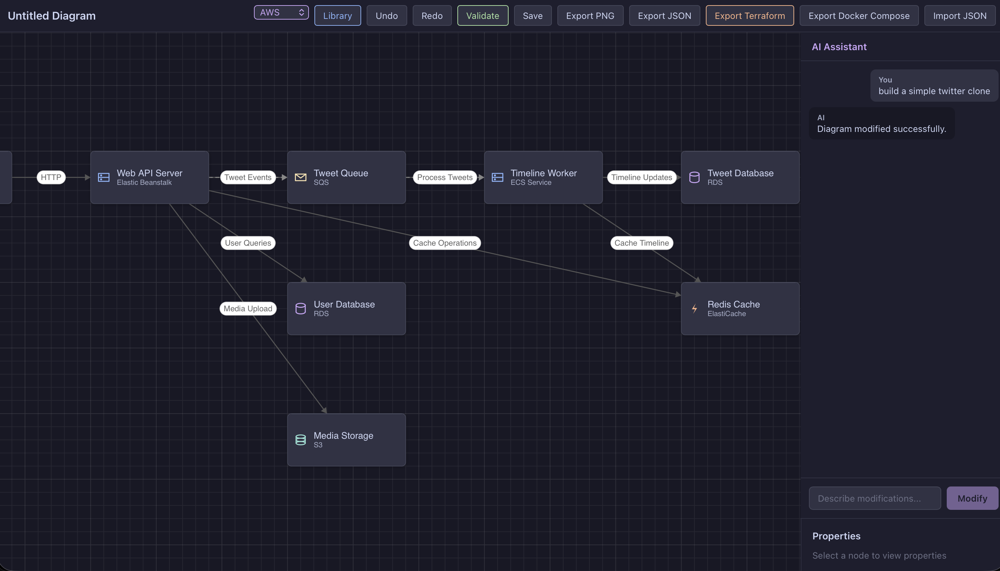

# vibes

A collection of projects built entirely through "vibe coding" — an experimental approach where every project is created using only AI-assisted development. The goal is to explore how far you can take vibes coding to plan, build, and maintain full projects while still following the same best practices you'd expect from traditional development.

## Projects

### [Weather App](weather-app-copilot-claude-code/)

A modern, cross-platform desktop weather application built with Tauri, Angular, and Rust. Features real-time weather information with hourly and daily forecasts, location search, weather-themed UI, and smooth animations.

<table>
  <tr>
    <td></td>
    <td></td>
  </tr>
</table>

### [ByteByteGo AI Course](ai-course/)

A self-hosted AI course platform covering fundamentals to expert-level techniques. Built with a FastAPI backend serving markdown-based lessons and a vanilla JavaScript frontend with progress tracking. Covers LLM foundations, RAG, prompt engineering, AI agents, reasoning models, and multi-modal generation across 6 modules.

### [Python Course](python-course-catalogue/)

A full-stack Python learning platform with 32 lessons across 7 sections, covering fundamentals through advanced topics like design patterns and REST APIs. Built with FastAPI, SQLite, and a vanilla JS frontend styled with a dark VS Code-inspired theme. Features JWT auth, progress tracking, and client-side markdown rendering.

### [Nimbus](nimbus/)

A cloud architecture design tool for building and visualizing infrastructure diagrams. Features an interactive canvas with drag-and-drop AWS components, visual connections, an AI assistant for natural language diagram modifications, and export to PNG/JSON/Terraform/Docker Compose. Built with Angular 19 and Rust/Axum.

### [Docker TUI](docker-tui/)

A terminal UI for monitoring Docker Compose containers in real time. Displays live CPU, memory, network I/O, and block I/O metrics with real-time charts. Built with Rust, ratatui, and bollard. Supports Docker Desktop, OrbStack, and standard Linux sockets.

