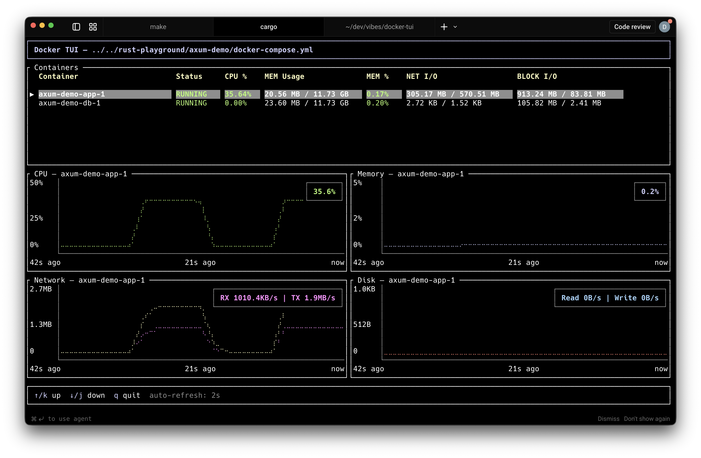

# docker-tui

A terminal UI for monitoring Docker Compose containers in real time. Built with Rust, [ratatui](https://github.com/ratatui/ratatui), and [bollard](https://github.com/fussybeaver/bollard).



## Features

- Live container table with CPU %, memory, network I/O, and block I/O
- Real-time charts for the selected container:
  - **CPU** and **Memory** (percent, auto-scaling y-axis)
  - **Network** (RX/TX bytes/s, dual-line)
  - **Disk** (Read/Write bytes/s, dual-line)
- Persistent streaming connections to Docker for accurate, gap-free metrics
- Current value badges on each chart
- Auto-discovers containers from a `docker-compose.yml` file
- Falls back to all running containers if no compose file is found
- Supports Docker Desktop, OrbStack, and standard Linux sockets

## Usage

```bash
# Monitor containers from docker-compose.yml in the current directory
cargo run

# Point at a specific compose file
cargo run -- /path/to/docker-compose.yml
```

## Keybindings

| Key       | Action                    |
|-----------|---------------------------|
| `↑` / `k` | Select previous container |
| `↓` / `j` | Select next container     |
| `q` / `Esc` | Quit                   |

## Requirements

- Rust 1.85+
- Docker daemon running (Docker Desktop, OrbStack, or native)

## Building

```bash
cargo build --release
./target/release/docker-tui
```
