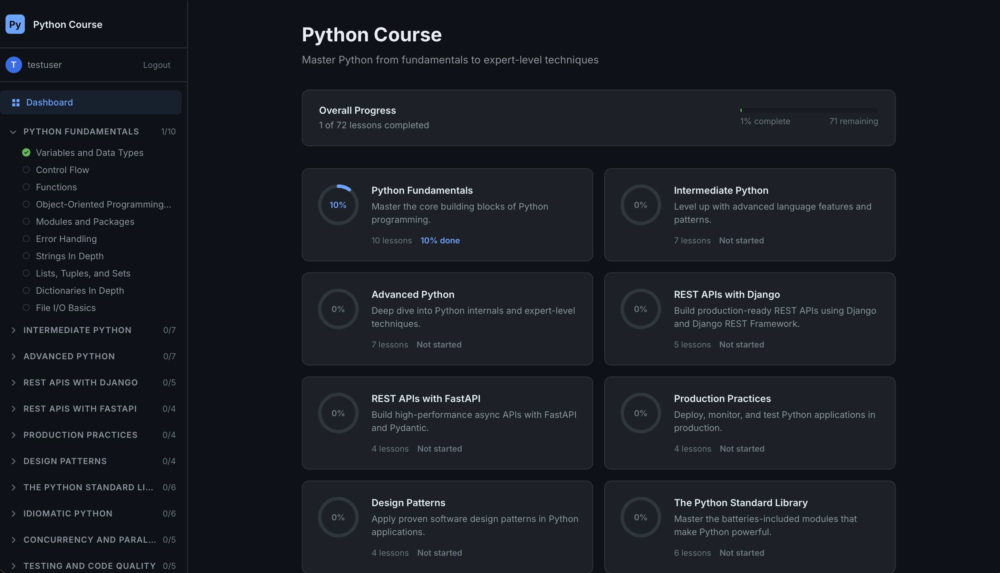
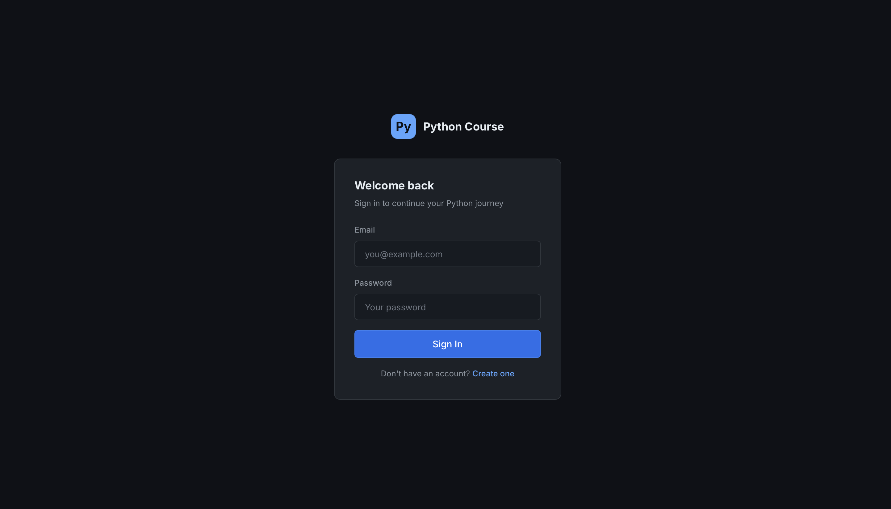

# Python Course

A full-stack Python learning platform with 32 lessons across 7 sections, covering fundamentals through advanced topics like design patterns and REST APIs. Built with a FastAPI backend and a vanilla JS frontend styled with a dark VS Code-inspired theme.





## Features

- **32 Markdown-based lessons** organized into 7 sections (Python Fundamentals, Intermediate Python, Advanced Python, REST APIs with Django, REST APIs with FastAPI, Production Practices, Design Patterns)
- **User authentication** with JWT-based login and registration
- **Progress tracking** — mark lessons complete and see per-section and overall completion percentages
- **Client-side Markdown rendering** with syntax highlighting (marked.js + Prism.js)
- **Collapsible sidebar** with section navigation and completion indicators

## Tech Stack

| Layer | Technology |
|-------|------------|
| Backend | FastAPI 0.110, SQLAlchemy 2.0, SQLite |
| Auth | JWT (python-jose), bcrypt |
| Content | Markdown files with YAML frontmatter (python-frontmatter) |
| Frontend | Vanilla HTML/CSS/JS, marked.js, Prism.js |
| Deployment | Docker / Docker Compose |

## Getting Started

### Prerequisites

- Python 3.10+
- pip

### Setup

```bash
cd backend
python -m venv .venv
source .venv/bin/activate
pip install -r requirements.txt
```

Create a `.env` file in `backend/` (see `.env.example` for reference).

### Run

```bash
cd backend
source .venv/bin/activate
uvicorn app.main:app --reload --port 8000
```

Open [http://localhost:8000](http://localhost:8000).

### Docker

```bash
docker-compose up --build
```

## API Routes

| Method | Path | Auth | Description |
|--------|------|------|-------------|
| POST | `/api/auth/register` | No | Register a new user, returns JWT |
| POST | `/api/auth/login` | No | Login, returns JWT |
| GET | `/api/auth/me` | Yes | Current user info |
| GET | `/api/courses` | Yes | All sections and lesson metadata |
| GET | `/api/courses/{section}/{lesson}` | Yes | Full lesson with Markdown content |
| GET | `/api/progress` | Yes | User's completion data |
| POST | `/api/progress/{section}/{lesson}` | Yes | Toggle lesson completion |

## Project Structure

```
├── backend/
│   ├── app/
│   │   ├── main.py            # FastAPI app, CORS, static mount
│   │   ├── auth/              # Models, schemas, service, router
│   │   ├── courses/           # Content loader, schemas, router
│   │   └── progress/          # Models, schemas, service, router
│   └── content/               # 7 sections × 4-6 markdown lessons
├── frontend/
│   ├── index.html             # Single HTML shell
│   ├── css/                   # Modular stylesheets
│   └── js/                    # Store, router, API client, pages, components
├── Dockerfile
└── docker-compose.yml
```

## Content Format

Lessons are Markdown files with YAML frontmatter:

```markdown
---
title: "Decorators in Python"
description: "Learn how to write and use decorators"
duration_minutes: 25
order: 1
---

## Lesson content here...
```

## License

MIT
