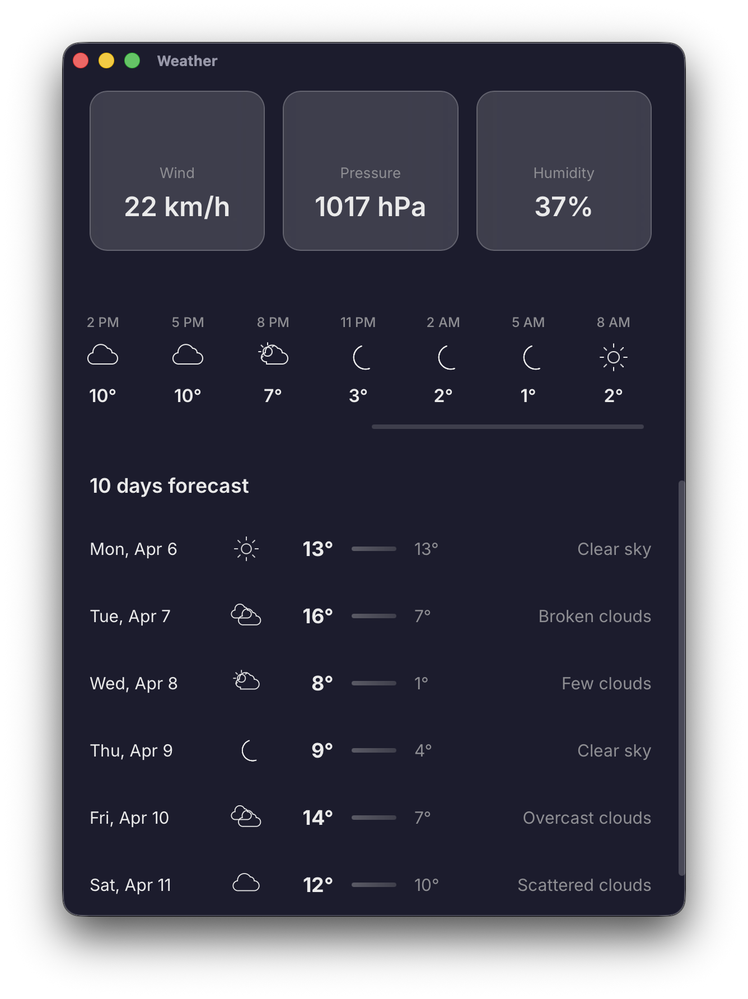

# Weather App

A modern, cross-platform desktop weather application built with [Tauri](https://tauri.app/), [Angular](https://angular.io/), and [Rust](https://www.rust-lang.org/). Get real-time weather information with hourly and daily forecasts for any location.

## Screenshots & Demo

<div style="display: flex; gap: 10px; margin-bottom: 20px;">
  
  
</div>

**Demo Video:** [home.mov](./home.mov)

## Features

- **Current Weather Display** - Real-time temperature, humidity, pressure, wind speed, and conditions
- **Hourly Forecast** - 24-hour weather predictions with precipitation probability
- **Daily Forecast** - Extended forecast for upcoming days
- **Location Search** - Find weather for any location worldwide
- **Responsive Design** - Optimized UI that adapts to different screen sizes (420×780 base)
- **Modern Animations** - Smooth scroll reveals and transitions
- **Personality Headlines** - Contextual weather descriptions based on current conditions
- **Theme Support** - Themed UI that adapts to weather conditions

## Technology Stack

### Frontend
- **Framework**: Angular 21.2
- **Language**: TypeScript
- **Build Tool**: Angular CLI
- **Styling**: SCSS

### Backend
- **Runtime**: Tauri 2.10.3
- **Language**: Rust
- **Logging**: tauri-plugin-log

### Desktop
- **Platform**: Tauri (macOS, Windows, Linux compatible)

## Component Documentation

For detailed information about specific parts of the project, see:

- **[Frontend Documentation](./frontend/README.md)** - Angular application, components, services, and development setup
- **[Tauri Backend Documentation](./src-tauri/README.md)** - Tauri framework, Rust code, and desktop app configuration
- **[Backend API Documentation](./backend/README.md)** - REST API endpoints, services, and server logic

## Project Structure

```
weather-app-copilot-claude-code/
├── frontend/                      # Angular frontend application
│   ├── src/
│   │   ├── app/
│   │   │   ├── features/         # Feature modules (weather, etc.)
│   │   │   │   └── weather/
│   │   │   │       ├── hero-section/
│   │   │   │       ├── hourly-forecast/
│   │   │   │       ├── daily-forecast/
│   │   │   │       ├── data-cards/
│   │   │   │       ├── advisory-bar/
│   │   │   │       └── loading-overlay/
│   │   │   ├── shared/           # Shared services and components
│   │   │   │   ├── services/
│   │   │   │   │   ├── weather.service.ts
│   │   │   │   │   ├── location.service.ts
│   │   │   │   │   └── weather-store.service.ts
│   │   │   │   ├── models/
│   │   │   │   │   ├── weather.model.ts
│   │   │   │   │   └── theme.model.ts
│   │   │   │   ├── components/
│   │   │   │   ├── pipes/
│   │   │   │   └── directives/
│   │   │   ├── app.ts            # Root component
│   │   │   └── app.config.ts     # App configuration
│   │   └── main.ts               # Bootstrap entry point
│   ├── package.json
│   └── tsconfig.json
│
├── src-tauri/                     # Tauri/Rust backend
│   ├── src/
│   │   ├── main.rs               # Application entry point
│   │   └── lib.rs                # Core library logic
│   ├── Cargo.toml                # Rust dependencies
│   └── tauri.conf.json           # Tauri configuration
│
└── README.md                      # This file
```

## Getting Started

### Prerequisites

- **Node.js** 18+ and npm 11.8.0+
- **Rust** 1.77.2+ ([Install Rust](https://rustup.rs/))
- **Tauri CLI** (installed via npm)

### Installation

1. **Clone the repository**
   ```bash
   git clone <repository-url>
   cd weather-app-copilot-claude-code
   ```

2. **Install frontend dependencies**
   ```bash
   cd frontend
   npm install
   cd ..
   ```

3. **Install Tauri dependencies**
   ```bash
   npm install -g @tauri-apps/cli
   ```

### Development

**Run the development server:**
```bash
npm run tauri dev
```

This will:
- Start the Angular development server on `http://localhost:4200`
- Build and run the Tauri application with hot reload

**Frontend only (web development):**
```bash
cd frontend
npm run start
```

Navigate to `http://localhost:4200/`. The application will automatically reload if you change any source files.

### Build for Production

**Build the native application:**
```bash
npm run tauri build
```

This creates a distributable executable for your platform:
- **macOS**: `.app` bundle and `.dmg` installer
- **Windows**: `.exe` installer and portable executable
- **Linux**: AppImage and other formats

**Build frontend only:**
```bash
cd frontend
npm run build
```

## Available Scripts

### Frontend
- `npm run start` - Start Angular dev server
- `npm run build` - Build for production
- `npm run watch` - Watch for changes and rebuild
- `npm run test` - Run tests

### Development
- `npm run tauri dev` - Run app in development with hot reload
- `npm run tauri build` - Create production binary

## Configuration

### Window Settings
Edit `src-tauri/tauri.conf.json` to customize:
- Window dimensions (default: 420×780)
- Minimum size (380×600)
- Application title and identifier
- Bundle icons and targets

### API Integration
Weather data is provided through services in `frontend/src/app/shared/services/`:
- `weather.service.ts` - Handles weather API requests
- `location.service.ts` - Manages location/search functionality
- `weather-store.service.ts` - Central state management for weather data

## Key Components

### Hero Section
Displays current weather prominently with temperature, condition, and location.

### Data Cards
Shows detailed metrics: humidity, pressure, wind speed, wind direction, and more.

### Hourly Forecast
Scrollable 24-hour forecast with time, temperature, condition, and precipitation probability.

### Daily Forecast
Extended forecast showing daily highs/lows and conditions.

### Advisory Bar
Displays weather alerts or important information.

## Models & Types

### Weather Data
- `CurrentWeather` - Current conditions with metadata
- `HourlyForecast` - Hourly predictions
- `DailyForecast` - Daily predictions
- `GeoLocation` - Location information

### Supported Conditions
- Clear, Clouds, Rain, Drizzle, Thunderstorm, Snow, Mist, Fog, Haze, Dust, Tornado

## Performance

- **Lazy loading** of feature modules
- **Scroll reveal animations** for enhanced UX
- **Efficient state management** with weather-store service
- **Optimized bundle size** with tree-shaking and minification

## Contributing

1. Create a feature branch (`git checkout -b feature/amazing-feature`)
2. Commit your changes (`git commit -m 'Add amazing feature'`)
3. Push to the branch (`git push origin feature/amazing-feature`)
4. Open a Pull Request

## Troubleshooting

### Port Already in Use
If port 4200 is in use:
```bash
ng serve --port 4201
```

### Tauri Build Errors
Ensure Rust is properly installed:
```bash
rustup update
```

### Node Modules Issues
Clear and reinstall dependencies:
```bash
rm -rf node_modules frontend/node_modules
npm install
cd frontend && npm install
```

## License

[Add your license here]

## Support

For issues, feature requests, or questions, please open an issue on GitHub or contact the maintainers.

---

**Built with ❤️ using Tauri, Angular, and Rust**
